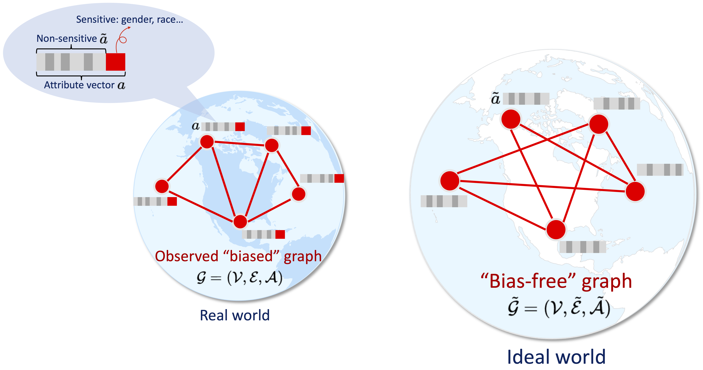

# UGE-Unbiased-Graph-Embedding

This is the code for the paper "Unbiased Graph Embedding with Biased Graph Observations" accepted by WWW'22.


## Introduction


Unbiased Graph Embedding (UGE) is based on the idea of learning unbiased node representations from an underlying bias-free graph, where only non-sensitive attributes are involved in the graph generation. We proposed two ways to achieve that: (1) a weighting based method (**UGE-W**), where the weighted link reconstruction loss is calculated from the bias-free graph, in expectation. This is a **sufficient condition** for unbiased graph embedding. (2) a regularization based method (**UGE-R**), which is requiring the resulting embeddings to have the properties of those directly learned from a bias-free graph. This is a **necessary condition** for unbiased graph embedding. We also combined these two methods (UGE-C) to **achieve sufficient-necessary condition trade-off**.


## Requirements

Code is tested in Python 3.8 and PyTorch 1.8~1.11. Some major requirements are listed below:

```
torch~=1.11.0
cuda~=10.1
dgl~=0.8.1
pandas~=1.4.2
numpy~=1.22.2
scipy~=1.8.0
tqdm~=4.64.0
sklearn~=1.0.2
```

## Datasets

We include three datasets: **Pokec-z**, **Pokec-n** and **Movielens-1M**. Raw data are uploaded or will be automatically downloaded to <code>./raw_data</code> folder. We have constructed graphs from the raw data and stored them in <code>./processed_data</code> folder in unified csv format for the model to load directly.

1. **Pokec-z** and **Pokec-n** are sampled from [soc_Pokec](http://snap.stanford.edu/data/soc-Pokec.html) following [FairGNN](https://github.com/EnyanDai/FairGNN). Raw and processed data have been already uploaded to <code>./raw_data</code> and <code>./processed_data</code> folders. 
2. **Movielens-1M**'s [raw data](https://grouplens.org/datasets/movielens/1m/) is too large to hold on github, and it can be automatically downloaded to <code>./raw_data</code> folder and be processed to <code>./processed_data</code> folder when launching a training process. 

We predefine the **sensitive attributes** to debias as follows, which is specified in <code>data_loader.py</code>.

```
SENSITIVE_ATTR_DICT = {
  'movielens': ['gender', 'occupation', 'age'],
  'pokec-z': ['gender', 'region', 'age'],
  'pokec-n': ['gender', 'region', 'age']
}
```


<p>To include and customize your own data, please refer to <code>data_loader.py</code>.</p>

## Run the Code

We support graph embedding models including **gcn, gat, sgc, sage, node2vec**. We support our proposed debiasing methods including **UGE-W** (weighting based), **UGE-R** (regularization based) and **UGE-C** (combined), as well as vanilla training without debiasing.

We launch <code>run_graph_embedding.py</code> to firstly learn the node embeddings and store the array in `./embeddings` folder, then evaluate the **utility** (ndcg on link prediction), **unbiasedness** (micro-f1 on sensitive attribute prediction) and **fairnss** (EO/DP) of learned embeddings.

Below shows some command examples to run the code in different settings, and let us use `gat` model on `pokec-z` dataset with debiasing `gender` attribute as an example.

1. Vanilla gat: training without debiasing.

```
python run_graph_embedding.py --epochs=800 --dataset=pokec-z --model=gat --debias_method=none --debias_attr=none
```

2. UGE-W: weighting-based debiasing, which first precomputes the edge weighting by sampling snippets from the graph and store the weights to `./precomputed_weights` folder, then trains with reweighted loss.

```
python run_graph_embedding.py --epochs=800 --dataset=pokec-z --model=gat --debias_method=uge-w --debias_attr=gender
```

4. UGE-R: regularization-based debiasing, which add a regularization term to the loss with weight 0.5.

```
python run_graph_embedding.py --epochs=800 --dataset=pokec-z --model=gat --debias_method=uge-r --debias_attr=gender --reg_weight=0.5
```

5. UGE-C: combining weighted and regularization based debiasing methods, with regularization weight 0.5.

```
python run_graph_embedding.py --epochs=800 --dataset=pokec-z --model=gat --debias_method=uge-c --debias_attr=gender --reg_weight=0.5
```

## Misc

**Seperate Embedding learning and Evaluation**: `./evaluate.py` also supports evaluating multiple embedding files under a folder. You can first obtain a bounch of embeddings with different hyperparameters under a folder, and run `./evaluate.py` to calculate and store all the metrics into file on these embeddings.

**Random baseline**: directly calling `eval_unbiasedness_pokec(data_name, embed_file=None)` or `eval_unbiasedness_movielens(data_name, embed_file=None)` with setting ` embed_file=None` in `./evaluate.py` will not load existing learned embeddings but calculate the metrics of random generated embeddings.

## Cite

Please cite our paper if you find this repo useful for your research or development.

Proceedings of the ACM Web Conference 2022:
```
@inproceedings{wang2022unbiased,
  author = {Wang, Nan and Lin, Lu and Li, Jundong and Wang, Hongning},
  title = {Unbiased Graph Embedding with Biased Graph Observations},
  year = {2022},
  isbn = {9781450390965},
  publisher = {Association for Computing Machinery},
  address = {New York, NY, USA},
  url = {https://doi.org/10.1145/3485447.3512189},
  doi = {10.1145/3485447.3512189},
  booktitle = {Proceedings of the ACM Web Conference 2022},
  pages = {1423–1433},
  numpages = {11},
  keywords = {sensitive attributes, bias-free graph, unbiased graph embedding},
  location = {Virtual Event, Lyon, France},
  series = {WWW '22}
}
```


